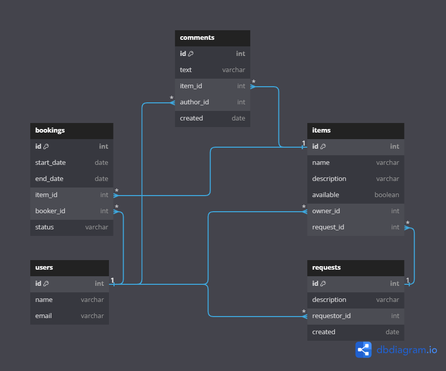

# ShareIt

## Описание
**ShareIt** - это сервис, который обеспечивает пользователям, во-первых, возможность рассказывать, какими вещами они готовы поделиться, а во-вторых, находить нужную вещь и брать её в аренду на какое-то время. 

Сервис позволяет не только бронировать вещь на определённые даты, но и закрывать к ней доступ на время бронирования от других желающих.

На случай, если нужной вещи на сервисе нет, у пользователей есть возможность оставлять запросы. По запросу можно добавлять новые вещи для шеринга. 

Реализован в виде двух микросервисов: 
- **gateway** - для валидации запросов пользователей
- **server** - для выполнения работы после валидации, в том числе для обращения к базе данных.

## Функционльность проекта
### Функциональность эндпонта /bookings

- **POST /bookings** - создание нового бронирования вещи. `userId` пользователя, создающего бронирование, передается в качестве заголовка `X-Sharer-User-Id`

- **PATCH /bookings/{bookingId}?approved={approved}** - подтверждение или отклонение бронирования вещи владельцем. `userId ` пользователя, создавшего бронирование, передается в качестве заголовка `X-Sharer-User-Id`

- **GET /bookings/{bookingId}** - получение бронирования вещи по `bookingId`. `userId` пользователя, бронирующего вещь, передается в качестве заголовка `X-Sharer-User-Id`. Бронирование может посмотреть только пользователь, осуществляющий бронирование, или владелец вещи

- **GET /bookings?state={state}&from={from}&size={size}** - получение списка всех бронирований пользователя, отсортированных по дате от более новым к старым. `userId` пользователя передается в качестве заголовка `X-Sharer-User-Id`. Параметр `state` задает статус бронирования (по умолчанию равен ALL, также он может принимать значения CURRENT, PAST, FUTURE, WAITING, REJECTED, а все прочие значения считаются не валидными). Параметр `from` - номер первого выводимого элемента из списка (по умолчанию = 0), параметр `size` задает количество элементов для отображения (по умолчанию = 15)

- **GET /bookings/owner?state={state}&from={from}&size={size}** - получение списка всех бронирований вещей, принадлежащих пользователю, отсортированных по дате от более новых к старым. `userId` пользователя передается в качестве заголовка `X-Sharer-User-Id`. Параметр `state` задает статус бронирования (по умолчанию равен ALL, также он может принимать значения CURRENT, PAST, FUTURE, WAITING, REJECTED, а все прочие значения считаются не валидными). Параметр `from` - номер первого выводимого элемента из списка (по умолчанию = 0), параметр `size` задает количество элементов для отображения (по умолчанию = 15)

### Функциональность эндпонта /items

- **POST /items** - добавление новой вещи. `userId` пользователя, создающего бронирование, передается в качестве заголовка `X-Sharer-User-Id`

- **PATCH /items/{itemId}** - внесение изменений пользователем в созданную вещь. `userId` пользователя, вносящего измененияб. передается в качестве заголовка `X-Sharer-User-Id`

- **GET /items/{itemId}** - получение информации о вещи по его id любым пользователем. `userId` владельца вещи передается в качестве заголовка `X-Sharer-User-Id`

- **GET /items?from={from}&size={size}** - получение списка всех своих вещей владельцем. `userId` владельца передается в качестве заголовка `X-Sharer-User-Id`. Параметр `from` - номер первого выводимого элемента из списка (по умолчанию = 0), параметр `size` задает количество элементов для отображения (по умолчанию = 15)

- **GET /items/search?text={text}&from={from}&size={size}** - получение списка вещей по текстовому запросу. Пользователь передаёт в строке запроса текст `text`, и сервис ищет все вещи, содержащие этот текст в названии или описании. Параметр `from` - номер первого выводимого элемента из списка (по умолчанию = 0), параметр `size` задает количество элементов для отображения (по умолчанию = 15). Можно найти только доступные для бронирования вещи

- **POST /items/{itemId}/comment** - добавление пользователем отзыва на вещь. `userId` пользователя передается в качестве заголовка `X-Sharer-User-Id`. Отзыв можно оставить только если пользователь брал вещь в аренду и только после окончания аренды

### Функциональность эндпонта /requests

- **POST /requests** - создание пользователем нового запроса на вещь. `userId` пользователя, создающего запрос, передается в качестве заголовка `X-Sharer-User-Id`

- **GET /requests** - получение пользователем всех своих запросов на создание вещей вместе с данными об ответах на них отсортированных по дате от более новых к старым. `userId` пользователя, создававшего запросы на создание вещей, передается в качестве заголовка `X-Sharer-User-Id`

- **GET /requests/all?from={from}&size={size}** - получение пользователем постраничного списка запросов вещей, созданных другими пользователями, отсортированных по дате от более новых к старым, за исключением запросов самого пользователя, запрашивающего указанный список. `userId` пользователя передается в качестве заголовка `X-Sharer-User-Id`. Параметр `from` - номер первого выводимого элемента из списка (по умолчанию = 0), параметр `size` задает количество элементов для отображения (по умолчанию = 15)

- **GET /requests/{requestId}** - получение пользователем запроса по его `requestId` вместе с данными об ответах на него. `userId` пользователя передается в качестве заголовка `X-Sharer-User-Id`

### Функциональность эндпонта /users

- **POST /users** - добавление нового пользователя

- **GET /users/{userId}** - получение пользователя по его `userId`

- **GET /users** - получение списка всех пользователей

- **PATCH /users/{userId}** - обновление данных пользователя по его `userId`

- **DELETE /users/{userId}** - удаление пользователя по его `userId`

## Схема базы данных

